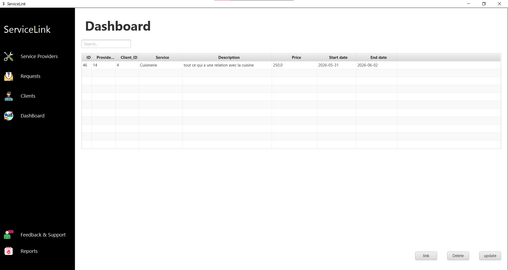
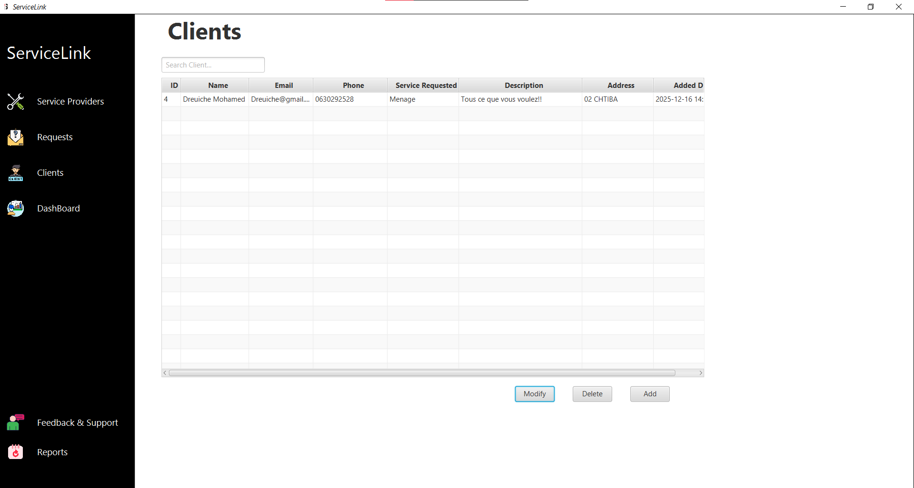
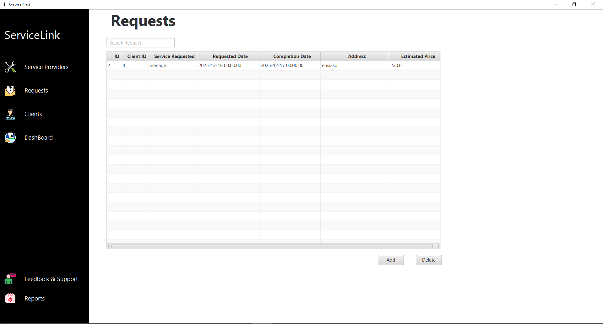

# EaseLink V2

Application de gestion de services Java/JavaFX permettant de mettre en relation des clients avec des prestataires de services, de suivre les demandes et de piloter les contrats via un tableau de bord centralisé.

---

## Sommaire

- [Aperçu](#aperçu)
- [Fonctionnalités](#fonctionnalités)
- [Technologies utilisées](#technologies-utilisées)
- [Prérequis](#prérequis)
- [Installation](#installation)
- [Configuration de la base de données](#configuration-de-la-base-de-données)
- [Structure du projet](#structure-du-projet)
- [Utilisation](#utilisation)
- [Screenshots](#screenshots)

---

## Aperçu

EaseLink V2 est une application de bureau développée en Java avec JavaFX. Elle permet à un gestionnaire de services de :

- Gérer un portefeuille de **clients** et de **prestataires**
- Créer et suivre des **demandes de services**
- **Lier** des clients à des prestataires adaptés à leurs besoins
- Visualiser l'ensemble des contrats actifs depuis un **tableau de bord**

L'accès à l'application est sécurisé par une page de connexion avec authentification en base de données.

---

## Fonctionnalités

**Tableau de bord**
- Vue d'ensemble de tous les contrats actifs (liaisons client–prestataire)
- Consultation des dates de début et de fin de contrat
- Rafraîchissement automatique des données

**Gestion des clients**
- Ajout, modification et suppression de clients
- Informations gérées : nom, e-mail, téléphone, adresse, service demandé, description, date d'ajout
- Recherche et filtrage dans la liste

**Gestion des prestataires**
- Ajout, modification et suppression de prestataires de services
- Informations gérées : nom, e-mail, téléphone, services proposés, description, tarif, date d'ajout
- Recherche et filtrage dans la liste

**Demandes de services**
- Création de demandes associées à un client
- Suivi des dates de demande et de réalisation, de l'adresse et du prix estimé
- Gestion complète CRUD

**Liaison client–prestataire**
- Interface dédiée pour associer un client à un prestataire
- Sélection par recherche dans deux tableaux côte à côte
- Définition de la période de contrat (date de début / date de fin) via un sélecteur de dates
- Modification et suppression des liaisons existantes

**Authentification**
- Page de connexion sécurisée
- Mot de passe haché avec SHA-256 en base de données

---

## Technologies utilisées

| Composant | Technologie |
|---|---|
| Langage | Java 11+ |
| Interface graphique | JavaFX (FXML + CSS) |
| Base de données | MySQL |
| Connecteur BDD | JDBC (MySQL Connector/J) |
| IDE recommandé | Eclipse (projet `.classpath` / `.project` inclus) |
| Build | Maven ou classpath Eclipse |

---

## Prérequis

- **JDK 11** ou supérieur
- **JavaFX SDK** (si non inclus dans le JDK)
- **MySQL Server** (version 5.7 ou supérieure)
- **MySQL Connector/J** dans le classpath
- IDE Eclipse (ou tout autre IDE Java compatible)

---

## Installation

1. **Cloner ou décompresser** le projet dans votre espace de travail.

2. **Importer dans Eclipse** :
   - `File > Import > Existing Projects into Workspace`
   - Sélectionner le dossier `EaseLink_V2`

3. **Ajouter les dépendances** :
   - Ajouter le JAR `mysql-connector-java-x.x.x.jar` dans `Build Path > Add External JARs`
   - Configurer le module JavaFX si nécessaire (`--module-path` et `--add-modules javafx.controls,javafx.fxml`)

4. **Lancer l'application** en exécutant la classe `application.Main`.

---

## Configuration de la base de données

### 1. Créer la base de données

```sql
CREATE DATABASE javafx;
USE javafx;
```

### 2. Créer les tables

Exécuter le script fourni dans `Script de creation des tables.txt` :

```sql
CREATE TABLE Providers (
    id INT AUTO_INCREMENT PRIMARY KEY,
    name VARCHAR(100) NOT NULL,
    email VARCHAR(100) UNIQUE NOT NULL,
    phone VARCHAR(15) NOT NULL,
    service VARCHAR(50) NOT NULL,
    description TEXT,
    price DECIMAL(10, 2) NOT NULL,
    added_date TIMESTAMP DEFAULT CURRENT_TIMESTAMP
) ENGINE=InnoDB;

CREATE TABLE clients (
    id INT AUTO_INCREMENT PRIMARY KEY,
    name VARCHAR(255) NOT NULL,
    email VARCHAR(100) UNIQUE NOT NULL,
    phone VARCHAR(50) NOT NULL,
    service_requested VARCHAR(50) NOT NULL,
    description TEXT,
    address VARCHAR(255) NOT NULL,
    added_date TIMESTAMP DEFAULT CURRENT_TIMESTAMP
);

CREATE TABLE requests (
    request_id INT AUTO_INCREMENT PRIMARY KEY,
    client_id INT NOT NULL,
    service_requested VARCHAR(255) NOT NULL,
    requested_date DATETIME NOT NULL,
    completion_date DATETIME,
    address VARCHAR(255),
    estimated_price DECIMAL(10, 2),
    FOREIGN KEY (client_id) REFERENCES clients(id)
);

CREATE TABLE Provider_Client (
    id INT AUTO_INCREMENT PRIMARY KEY,
    provider_id INT NOT NULL,
    client_id INT NOT NULL,
    service VARCHAR(50) NOT NULL,
    description TEXT,
    price DECIMAL(10, 2) NOT NULL,
    start_date DATE,
    end_date DATE,
    FOREIGN KEY (provider_id) REFERENCES Providers(id) ON DELETE CASCADE,
    FOREIGN KEY (client_id) REFERENCES clients(id) ON DELETE CASCADE
);

CREATE TABLE ServiceManager (
    id INT AUTO_INCREMENT PRIMARY KEY,
    username VARCHAR(255) NOT NULL UNIQUE,
    password VARCHAR(255) NOT NULL
);

-- Compte administrateur par défaut
INSERT INTO ServiceManager (username, password)
VALUES ('admin', SHA2(CONCAT('admin', 'admin123'), 256));
```

### 3. Paramètres de connexion

Les paramètres de connexion se trouvent dans `src/application/Connect.java` :

```java
return DriverManager.getConnection("jdbc:mysql://localhost:3306/javafx", "root", "");
```

Modifier l'URL, le nom d'utilisateur et le mot de passe selon votre configuration MySQL locale.

---

## Structure du projet

```
EaseLink_V2/
├── src/
│   ├── application/
│   │   ├── Main.java               # Point d'entrée, navigation entre scènes
│   │   ├── Connect.java            # Connexion à la base de données
│   │   ├── Clients.java            # Modèle Client
│   │   ├── Providers.java          # Modèle Prestataire
│   │   ├── Requests.java           # Modèle Demande
│   │   └── ProviderClient.java     # Modèle Liaison Client–Prestataire
│   ├── Controllers/
│   │   ├── HomeController.java             # Navigation principale
│   │   ├── LoginController.java            # Authentification
│   │   ├── DashBoardController.java        # Tableau de bord des contrats
│   │   ├── ClientsController.java          # Liste et gestion des clients
│   │   ├── ServiceProvidersController.java # Liste et gestion des prestataires
│   │   ├── RequestsController.java         # Gestion des demandes
│   │   ├── LinkPageController.java         # Liaison client–prestataire
│   │   ├── AddClientController.java        # Formulaire ajout client
│   │   ├── AddProviderController.java      # Formulaire ajout prestataire
│   │   ├── AddRequestController.java       # Formulaire ajout demande
│   │   ├── UpdateClientController.java     # Formulaire modification client
│   │   ├── UpdateProviderController.java   # Formulaire modification prestataire
│   │   └── UpdateLinkController.java       # Formulaire modification liaison
│   └── Css/
│       ├── style.css
│       ├── Home.css
│       └── dashboard.css
├── bin/
│   └── Fxmls/                      # Fichiers FXML (interfaces graphiques)
│       ├── Home.fxml
│       ├── login.fxml
│       ├── DashBoard.fxml
│       ├── Clients.fxml
│       ├── ServiceProviders.fxml
│       ├── Requests.fxml
│       ├── LinkPage.fxml
│       └── ...
├── Script de creation des tables.txt
├── .classpath
└── .project
```

---

## Utilisation

1. Démarrer l'application — la page d'accueil s'affiche avec les 4 sections principales.
2. Se connecter via l'interface de login (identifiants par défaut : `admin` / `admin123`).
3. Naviguer entre les sections via le menu latéral :
   - **Dashboard** — vue des contrats en cours
   - **Clients** — gérer les clients
   - **Service Providers** — gérer les prestataires
   - **Requests** — gérer les demandes de services
4. Utiliser la page **Link** pour associer un client à un prestataire en définissant la période de contrat.

---
## Screenshots

### Tableau de bord


### Gestion des clients


### Gestion des requetes


### Gestion des prestataires


### Liaison client–prestataire


> Projet académique Java — EaseLink V2
